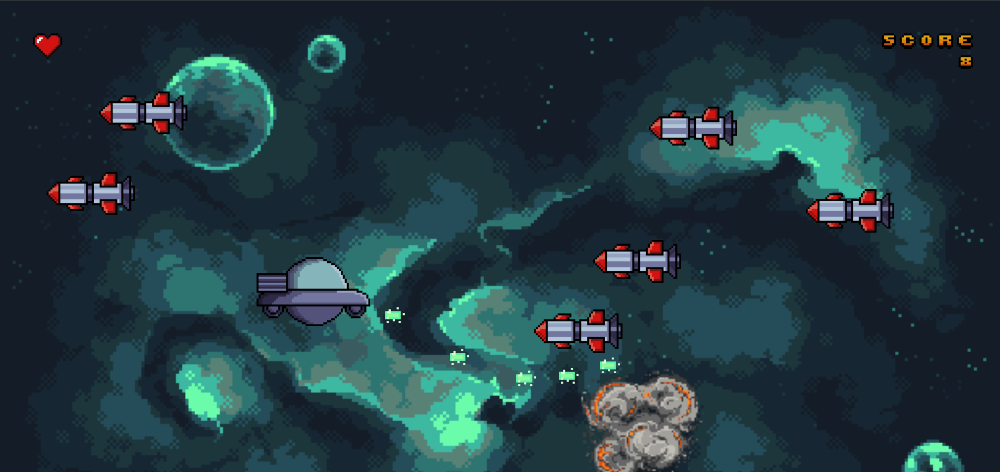

# Star Rickpocalypse

This is a browser-based space shooter inspired by 'Rick and Morty'. It is built with HTML, CSS, JavaScript, DOM manipulation, and Object-Oriented Programming (OOP).

## How to play
- Use your mouse to fly around warheads
- Left Mouse Button click to shoot
- You have three lives
- Destroy 50 warheads to win
- Play on desktop for better experience

[Click here to play](https://andrewnzrv.github.io/star-rickpocalypse/)

